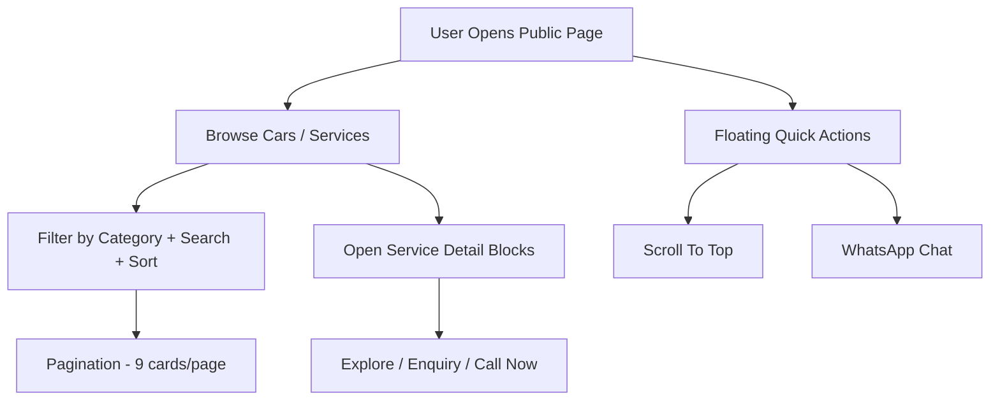
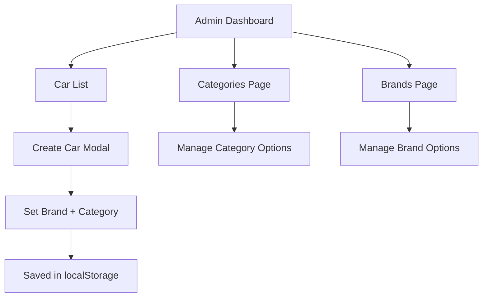

# CarRent Website

Modern multi-page car rental website with public + admin areas, responsive UI, reusable quick actions, dynamic car listing, and localStorage-based admin management.

## 1. Project Scope

### Public pages
- `index.html`
- `about.html`
- `service.html`
- `service-detail.html`
- `car-listing.html`
- `car-detail.html`
- `contact.html`

### Admin pages
- `admin/index.html`
- `admin/car-list.html`
- `admin/categories.html`
- `admin/brands.html`
- `admin/create-car.html` (redirects to `admin/car-list.html`)

## 2. Work Done (Complete Update)

### A) Global Public UI/UX
- Unified premium navbar + topbar look across public pages.
- Desktop mega services menu + mobile-friendly navigation behavior.
- Added/kept enquiry and quick call actions in navigation.
- Improved footer into a common reusable premium footer on public pages.
- Added floating quick actions globally via `js/footer.js`:
  - gradient `Scroll to Top` button
  - WhatsApp floating button (placed below scroll button)
- Added global overflow protection and mobile spacing fixes in `styles.css`.

### B) Hero/Banner Updates
- Applied hero/banner image sections on key pages (`car-listing`, `about`, `contact`, `service`) using matching style.
- Home hero shell updated with curved lower arc style and refined overlay intensity.
- Hero spacing adjusted under fixed navbar for cleaner visual hierarchy.

### C) Home Page (`index.html`)
- Refined sections for premium feel and responsive behavior.
- Enhanced popular cars rail/cards and CTA flow.
- Added `Experience Premium Service` follow-up enquiry section with:
  - required multi-field form
  - quick contact details with icons
  - embedded location map
  - gradient overlay styling and card-based layout

### D) Car Listing (`car-listing.html`, `js/car-listing.js`, `js/data.js`)
- Added/expanded dummy fleet to 20 cars in `js/data.js`.
- Implemented pagination with 9 cards per page (`CARS_PER_PAGE = 9`).
- Dynamic category sidebar rendering from car types.
- Mobile category toggle fixed to slide-in side panel (not dropdown).
- Category overlay, close action, and Escape-key close handling added.
- Search, sort, type/fuel/transmission filters, price range filtering, and reset flow maintained.

### E) Service Page (`service.html`)
- Expanded service details architecture with multiple rental/service blocks.
- Added monthly rental in packages.
- Added `Availability / Service Hours` section and redesigned cards.
- `Availability / Service Hours` cards now use custom radius pattern:
  - `11 50 11 50` style (`rounded-[11px_50px_11px_50px]`)
- Redesigned `Why Choose Us` using website primary/secondary theme.
- Replaced previous `8 Cities` metric with `24/7 Booking Support`.
- In `Explore Service Details`, each service block now has 3 CTAs:
  - `Explore`
  - `Enquiry`
  - `Call Now`
- Upgraded trust/process/policy/CTA presentation to more professional sections.

### F) About Page (`about.html`)
- Added large professional content stack under `Our Values`:
  - Our Story (2-column image + content)
  - Mission & Vision
  - Why Choose Us cards
  - Our Fleet
  - Safety Comes First
  - Our Team cards
  - Achievements stats block
  - Our Promise to You
- Kept structure consistent with existing theme tokens and responsive spacing.

### G) Contact Page (`contact.html`)
- Replaced older form with updated compact premium form layout.
- Form supports required fields for rental enquiry flow (name/email/phone/pickup/return/car/service/etc.).
- Quick contact panel includes icon-based items and embedded map section.
- Background + overlay styling aligned with service/home premium enquiry sections.

### H) Shared Footer + Enquiry Flow
- Footer newsletter interaction handled from `js/footer.js`.
- Consistent CTA and contact blocks in footer on major pages.
- Enquiry interactions preserved with modal/form handling where implemented.

## 3. Admin Panel (Major Redesign)

### A) Full admin UI redesign
- Applied updated admin visual system in `admin/css/admin.css`:
  - gradient/soft-glass panel look
  - polished menu states
  - improved form/table controls
  - mobile sidebar polish

### B) Sidebar upgrade
- Sidebar now rendered dynamically from `admin/js/admin-sidebar.js`.
- Added new menu links:
  - `Categories`
  - `Brands`

### C) Category + Brand management
- New pages:
  - `admin/categories.html`
  - `admin/brands.html`
- Add/list categories and brands from admin.
- Usage tables show count and average price per category/brand.

### D) Create Car modal improvements
- Updated in both:
  - `admin/car-list.html`
- Added required fields:
  - `Brand`
  - `Category`
- Improved modal layout and form grouping for better usability.

### E) Admin data layer improvements (`admin/js/admin-shared.js`)
- Added normalized storage support for:
  - cars (`adminCars`)
  - categories (`adminCategories`)
  - brands (`adminBrands`)
- Added helper stats and loaders:
  - `getCategoryStats()`
  - `getBrandStats()`
  - `loadCategories()` / `saveCategories()`
  - `loadBrands()` / `saveBrands()`
- Car normalization now keeps `type`, `category`, and `brand` consistent.

### F) Dashboard/insights updates
- `admin/index.html` now includes category/brand KPIs + top lists.

## 4. Data and Assets

- Fleet source remains `js/data.js` with 20 cars.
- Added/used multiple brand logos under `images/brands/`.
- Admin fallback image references shifted to `images/5.jpg` for safer preview handling.

## 5. Core Files Updated

### Public
- `index.html`
- `about.html`
- `service.html`
- `service-detail.html`
- `car-listing.html`
- `car-detail.html`
- `contact.html`
- `styles.css`
- `js/navbar.js`
- `js/home.js`
- `js/footer.js`
- `js/car-listing.js`
- `js/data.js`

### Admin
- `admin/index.html`
- `admin/car-list.html`
- `admin/categories.html` (new)
- `admin/brands.html` (new)
- `admin/css/admin.css`
- `admin/js/admin-sidebar.js`
- `admin/js/admin-shared.js`

## 6. User Flows

### Public flow

### Admin flow

## 7. Run / Usage

- Static project, no build step required.
- Open `index.html` directly in browser.
- Admin panel entry: `admin/index.html`.

## 8. Persistence Notes

- Public car dataset loads from `js/data.js`.
- Admin operations persist in browser localStorage.
- Reset/seed flows are handled through admin shared script.

## 9. Known Workspace Note

- Current workspace git status shows `images/1.jpg` as deleted.
- Some legacy references may still expect `images/1.jpg` in public pages/data; restore if needed for complete visual consistency.

## 10. Next Suggested Enhancements

- Backend API integration for cars, enquiries, and admin CRUD.
- Server-side auth/roles for admin pages.
- API-driven category/brand master with validation.
- Accessibility pass (ARIA labels, focus states, keyboard paths).
- Image optimization + lazy loading audit.
- Automated tests for listing filters/pagination/admin storage flows.
